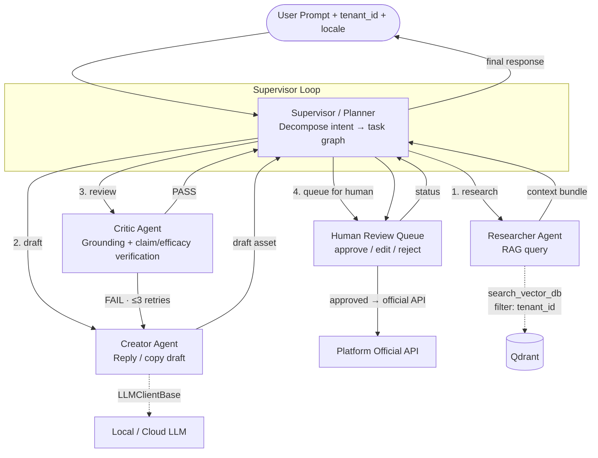

<!--
═══════════════════════════════════════════════════════════════════════════
🟢 REPO SCOPE BANNER — Nyxara (MIT · OPEN-SOURCE · SINGLE REPO)
═══════════════════════════════════════════════════════════════════════════
The Multi-Agent System described here IS the heart of this open-source repo —
Supervisor, Researcher, Creator, Critic, and a Human Reviewer gate (and, from
the OPTIONAL Visual track, the Visual Director and Video Producer), the tool
registry and the LangGraph state machine all live in Nyxara under `app/`.

The first product this graph serves is the **Comment Assistant**: read public
comments → grounded RAG retrieval → on-voice draft → Critic blocks fabricated
facts & unverified efficacy claims → **a human approves before anything is
sent** (no auto-post; sending uses the platform's **official API**).

Reminders binding in this repo:
  • Agents call LLMs ONLY through `LLMClientBase` — never `openai.*` directly.
  • This is a LEARNING engine, not a SaaS: NO billing/credit logic, NO user
    auth/management, NO admin dashboard. Token counting emits usage metadata
    for observability only — there is no wallet to debit.
  • `tenant_id` is a NAMESPACE selecting which niche's data/style apply. The
    engine enforces it on every DB/Vector path; it does NOT manage user
    identity or login.

See [`../rules/tech-stack-rule.md`](../rules/tech-stack-rule.md).
═══════════════════════════════════════════════════════════════════════════
-->

# 🧠 ORCHESTRATION & AI AGENT DESIGN — Nyxara (V4.0, Human-in-the-Loop)

> **DOCUMENT PURPOSE:** Defines the Multi-Agent System (MAS) architecture, agent profiles, tool registry, and execution workflow for N-Assistant Core.
> **FRAMEWORK:** LangGraph (state-machine graph) atop the FastAPI orchestrator, calling `LLMClientBase` engines.
> **COMPANION DOCS:** [`product-requirements.md`](product-requirements.md) · [`../rules/tech-stack-rule.md`](../rules/tech-stack-rule.md).

---

## §1. Why Supervisor–Worker, NOT Zero-Shot

A single mega-prompt ("be a marketing agent, do everything") is **forbidden** in this system. Reasons:

1. **Hallucination compounding.** When one prompt is responsible for research + draft + review, errors in the research step poison the draft with no checkpoint.
2. **No auditability.** A single LLM call leaves no trace of *why* a claim was made.
3. **Brand-voice drift.** Without a dedicated reviewer step, generated content drifts off-brand within 2–3 turns.
4. **Cost explosion.** A single big-context call burns 5–10× the tokens of specialized small-context calls.

Nyxara uses a **Supervisor–Worker** pattern: a Planner agent decomposes the user intent into ordered tasks; specialized Worker agents execute one task each with the minimum context they need; a Critic agent verifies before publication.

---

## §2. Topology



Implementation: LangGraph state machine. Each agent is a node, edges are conditional routes the Supervisor picks based on the state.

> **Growth path (OPTIONAL Visual track).** If the Visual & Character Engine is added (off the main learning path, needs a GPU), the graph gains two nodes: a **Visual Director** (turns the approved script into `{visual_prompt, style, scene}` JSON + drives ComfyUI/SDXL/ControlNet with a consistent character) and a **Video Producer** (image/text→video, TTS voice-clone, ffmpeg auto-edit). A **Domain Router** in front of the Supervisor selects the niche namespace + prompt/visual style. These are documented in §3.6–3.7 and slot in **without changing the existing nodes' contracts** — which is exactly why they can stay optional.

---

## §3. Agent Roles

### §3.1 Supervisor (Planner)

- **Goal:** Translate a user intent into an ordered task graph; route each task to the right worker; assemble the final response.
- **Holds the state:** `{ tenant_id, user_id, locale, intent, plan, scratchpad, retry_count, current_step }`.
- **Decision authority:** which worker runs next, when to short-circuit, when to give up after retries.
- **Forbidden:** generating user-facing content directly. The Supervisor coordinates; it does not write copy.
- **LLM tier:** Tier-1 (Cloud or strong local). Cheap to call, expensive to get wrong.

### §3.2 Researcher

- **Goal:** Gather grounded context for the Creator.
- **Tools:** `search_vector_db(tenant_id, query, top_k=8, locale=...)`, `fetch_trends(platform, locale, window="7d")`.
- **Drives the Phase 3 Advanced-RAG pipeline** (see [`master-execution-plan.md`](master-execution-plan.md) Phase 3 · [`../rules/tech-stack-rule.md`](../rules/tech-stack-rule.md) §5). The Researcher does not throw the raw query straight at the DB; it runs a togglable 3-stage pipeline:
  1. **Pre-Retrieval — Query Transformation** *(optional flag)*: Multi-Query split or HyDE before search. The transform runs **async** and emits a status run-event (so a 2–4 s local-LLM call doesn't look like a hang); *no UI is built for it in Phase 3 — that event is consumed by Phase 6's optional panel*.
  2. **Retrieval — Metadata-filter → Hybrid + RRF → Rerank → Small-to-Big**: a metadata payload filter (`product_id`, `price_band`, `category`, `locale`) narrows to the right product/price band **before** semantic ranking (live in the Comment Assistant — not "closest vector wins"); dense (bge-m3) + sparse (BM25) fused via RRF; a **cross-encoder reranker (`bge-reranker-v2-m3`)** re-scores the top-k by reading query+doc together (bi-encoder vs cross-encoder trade-off); chunking is a mode (`chunk_strategy="flat" | "semantic" | "parent_child"`) — **semantic chunking** splits by meaning, **parent-child** hits on child chunks fetch their wrapping parent (Qdrant payload index on `parent_id`).
  3. **Post-Retrieval — Context Compression** *(optional flag)*: an `LLMClientBase` extractor trims chunks to only the query-answering sentences (verbatim, no paraphrase; falls back to the raw chunk if an extraction isn't a substring of its source) — critical for the local model's token budget.
- **CRAG self-correction:** the LangGraph loop grades retrieval relevance and self-corrects **inside the local store** — re-query with a transformed query, widen `top_k`, relax the similarity threshold, or fall back to BM25-only — before the bundle is handed off. **No internet egress by default** (§8.6). An optional `web_search` correction tool exists but is **off by default and hard-disabled when `INFERENCE_MODE=self_hosted`**.
- **Output:** a context bundle `{retrieved_chunks: [...], trend_signals: [...], sources: [...]}`.
- **Forbidden:** generating any text the user will see; expressing opinions; calling Vector DB without `tenant_id`.
- **LLM tier:** Tier-2 (local OK). Mostly tool-calling, light reasoning — the query-transform and compression nodes are the only places it generates intermediate (never user-facing) text.

### §3.3 Creator

- **Goal:** Produce a draft asset — for the Comment Assistant, an on-voice **reply / post copy** — grounded **strictly** in the Researcher's context bundle. (Image/audio/storyboard drafting tools belong to the OPTIONAL Visual track, §3.6–3.7.)
- **Tools (core):** `generate_text`. *(Optional Visual track adds `generate_image`, `generate_audio`, `compose_storyboard`.)*
- **Discipline:** Every factual claim in the draft MUST be traceable to a Researcher source ID. Untraceable claim → Critic flags it.
- **Forbidden:** calling the Vector DB directly; introducing facts not present in context; publishing.
- **LLM tier:** Tier-1 for hero copy; Tier-2 for variants.

### §3.4 Critic (Reviewer)

- **Goal:** Verify the draft against four checks before it reaches the human reviewer:
  1. **Brand voice** — match tenant's brand-voice rubric (stored in their RAG).
  2. **Claim grounding** — every factual claim (price, ingredients, link…) links back to a Researcher source ID. Untraceable → FAIL.
  3. **Efficacy-claim guard** — **block unverified efficacy / health claims** (e.g. "cures acne", "100% safe"). Non-negotiable for cosmetics/health, where a wrong claim is a trust and legal problem. Any efficacy assertion not grounded in a source → FAIL.
  4. **Policy** — platform content-policy heuristics.
- **Output:** `{verdict: "pass" | "fail", reasons: [...], suggested_edits: [...]}`.
- **Loop:** on FAIL, hand back to Creator with `suggested_edits`. Max **3 retries**; on 4th attempt Supervisor escalates straight to the human reviewer. A PASS still goes to the human queue — the Critic is a gate *before* the human, never a replacement for them.
- **Forbidden:** rewriting the draft itself (its job is to judge, not to ghost-write).
- **LLM tier:** Tier-1 mandatory — the Critic is the moat against hallucination, do not cheap out. *Hardware reality:* a 3B-only local box cannot serve a reliable Tier-1 Critic; either route Tier-1 to a stronger engine (`INFERENCE_MODE=cloud|hybrid`) or accept best-effort grading with weaker anti-hallucination guarantees. See [`product-requirements.md`](product-requirements.md) §3.4 hardware/tier matrix.

### §3.5 Human Review Gate + Sender

- **Goal:** put every Critic-passed draft in front of a **human to approve, edit, or reject** — and only on approval, send it via the platform's **official API**. **The loop closes on a person, never on auto-send.**
- **Flow:** Critic PASS → draft enters the **human review queue** → a human approves/edits/rejects → on approval, `send_via_official_api(...)` posts the reply; on reject, it is dropped (optionally with feedback the Creator can learn from).
- **Tools:** `enqueue_for_review(tenant_id, asset_id)`, `send_via_official_api(tenant_id, asset_id, platform)`.
- **Side effects:** updates the local `replies` run history; emits a WebSocket/log run event.
- **Forbidden:** sending anything a human has **not** approved; browser automation / stealth posting; content modification after approval; reading another namespace's credentials; making LLM calls.
- **No reasoning agent here:** this is a deterministic gate + sender. There is **no autonomous Publisher agent.**

### §3.6 Visual Director — *OPTIONAL Visual track (needs GPU, off the main path), not yet implemented*

- **Goal:** turn the approved script into a visual plan and concrete imagery, with a **consistent character** across scenes.
- **Tools:** `generate_visual_plan` (emits `{visual_prompt, style, scene}` JSON), `comfyui_run(workflow, params)` driving SDXL/Flux + ControlNet + IP-Adapter/FaceID + a character LoRA.
- **Discipline:** the visual plan must trace back to the script (no inventing scenes the script never described). Character identity is pinned by the niche's character LoRA / FaceID reference.
- **Forbidden:** rewriting the script; publishing.
- **LLM tier:** Tier-1 for the plan; the diffusion work runs on the ComfyUI backend.

### §3.7 Video Producer — *OPTIONAL Visual track (needs GPU, off the main path), not yet implemented*

- **Goal:** assemble the final video from generated imagery.
- **Tools:** `image_to_video` / `text_to_video` (local models), `tts_clone(script, voice)` (XTTS/CosyVoice), `lip_sync`, `ffmpeg_edit` (subtitles, trend music, transitions).
- **Forbidden:** content/script changes; publishing (hands the finished asset back to the Supervisor → Publisher).
- **LLM tier:** none — deterministic media pipeline driven by the plan.

> A **Domain Router** sits in front of the Supervisor: given a niche (e.g. "Game AI"), it selects the retrieval namespace, prompt style, and visual style for the whole run.

---

## §4. Tool Registry (Pydantic v2 contracts)

Every tool input is a Pydantic v2 model with `model_config = ConfigDict(extra="forbid")`. The Supervisor refuses to call a tool whose schema doesn't validate.

```python
class SearchVectorDBInput(BaseModel):
    model_config = ConfigDict(extra="forbid")
    tenant_id: UUID
    query: str = Field(min_length=1, max_length=512)
    top_k: int = Field(default=8, ge=1, le=20)
    locale: Literal["vi", "en", "de", "zh"]

class GenerateTextInput(BaseModel):
    model_config = ConfigDict(extra="forbid")
    tenant_id: UUID
    prompt: str
    context_bundle_id: str   # references Researcher output, anti-hallucination
    locale: Literal["vi", "en", "de", "zh"]
    max_tokens: int = Field(default=512, ge=1, le=4096)
    tier: Literal["local", "cloud"] = "local"

class SendViaOfficialApiInput(BaseModel):
    model_config = ConfigDict(extra="forbid")
    tenant_id: UUID
    asset_id: UUID
    platform: Literal["tiktok_shop", "shopee", "youtube_shorts", "facebook", "instagram"]
    approved_by: str          # human reviewer id — sending requires a human approval
    schedule_at: datetime | None = None
```

> **No browser-automation tool exists in the registry.** Sending goes through a
> platform's **official API** and requires `approved_by` — a human approval. There
> is no `publish_to_platform` via headless/stealth browser anymore.

**Every tool input carries `tenant_id`.** No exceptions.

---

## §5. State, Memory & Persistence

| Scope | Mechanism | TTL |
|---|---|---|
| Per-turn agent state | LangGraph state object in memory | Lifetime of the request |
| Per-task scratchpad | LangGraph state + Redis snapshot for resume | 24h |
| Per-niche long-term memory | Qdrant (namespace-filtered by `tenant_id`) | Permanent |
| Per-niche voice / style profile | Local config / Postgres `niche_voice_profile` table | Permanent |
| Per-niche official-API credentials | Standard secret storage (env / `.env` / secret manager), used for official-API calls only — **no stealth-browser session vault** | Until expiry |
| Human review queue | Local `review_queue` table keyed by `tenant_id` + `asset_id` | Until approved/rejected |
| Run history / audit trail | Local `run_log` table keyed by `tenant_id` + `run_id` | Kept locally |

Resumability: every Supervisor decision boundary checkpoints to Redis with a `run_id`. A crashed run can be resumed from the last checkpoint without re-paying upstream token costs.

---

## §6. Error Handling, Retries, Idempotency

| Failure mode | Handling |
|---|---|
| Worker tool raises | Bubble to Supervisor; Supervisor decides retry vs escalate. **Never** swallow with bare `except`. |
| Critic FAIL | Loop back to Creator with `suggested_edits`. Max 3 cycles. |
| LLM rate limit | Exponential backoff + tier fallback (Cloud → Local). Logged. |
| Official-API send failure | Mark the send failed in the run log; surface it to the CLI/logs; do **not** retry blindly (respect the platform's rate limits / spam detection). |
| Vector DB timeout | Researcher returns empty context bundle with `degraded=true`; Critic refuses to pass any draft built on degraded context. |

**Idempotency keys** (`(tenant_id, run_id, step_id)`) on every official-API send so a retry never double-posts.

---

## §7. Multilingual Behavior

- Supervisor injects `locale` into every Worker's prompt.
- Researcher passes `locale` to RAG; bge-m3 handles cross-lingual matching → a German-locale request can still retrieve Vietnamese knowledge base entries if relevant.
- Creator's drafts are produced in the user's `locale`; brand voice rubric is matched on the locale-specific section of the tenant's voice profile.
- Critic verifies in the same locale as the draft.
- The human reviewer sees the draft in the user's `locale`; on approval, the official-API send uses that locale.

---

## §8. Strict Agent Rules

1. **Every tool call MUST carry `tenant_id`.** A tool without `tenant_id` in its input schema does not exist.
2. **No agent calls `openai.*` / `anthropic.*` / `transformers.pipeline(...)` directly.** Always `LLMClientBase`.
3. **Creator MUST cite source IDs from Researcher context.** Uncited claim → Critic FAIL.
4. **Critic CANNOT rewrite drafts.** Only judge and suggest.
5. **Nothing is sent without human approval.** The review gate requires a human `approved_by`; the sender is a deterministic tool runner (no LLM calls) and sends **only via official APIs** — never browser automation / stealth posting. There is no autonomous Publisher agent.
6. **No agent has internet egress except the official-API sender** (only to the platform's official API, only on a human-approved item) **and the optional CRAG `web_search` tool when explicitly enabled.** `web_search` is **off by default and hard-disabled when `INFERENCE_MODE=self_hosted`** (privacy-by-default for a local fork, enforced by `tech-stack-rule.md` §3.4). Default CRAG correction is in-store only — no egress.
7. **A new agent role requires an RFC and an update to §3 of this doc.** Rogue agents are a CI failure.
8. **Every Supervisor decision MUST be logged** with `{tenant_id, run_id, step, chosen_agent, reason}` for replay & audit.

---

## §9. Future Roles (Not Yet Implemented)

Documented here so the system knows where they slot in when added. Adding one requires updating §3.

- **Visual Director / Video Producer** — see §3.6–3.7 (OPTIONAL Visual track, needs GPU).
- **Analyst** — post-publication: pull engagement metrics, feed back into the Researcher's "what worked" memory per niche.
- **A/B Director** — split-test variants of the same asset across audience segments and reconcile winners.
