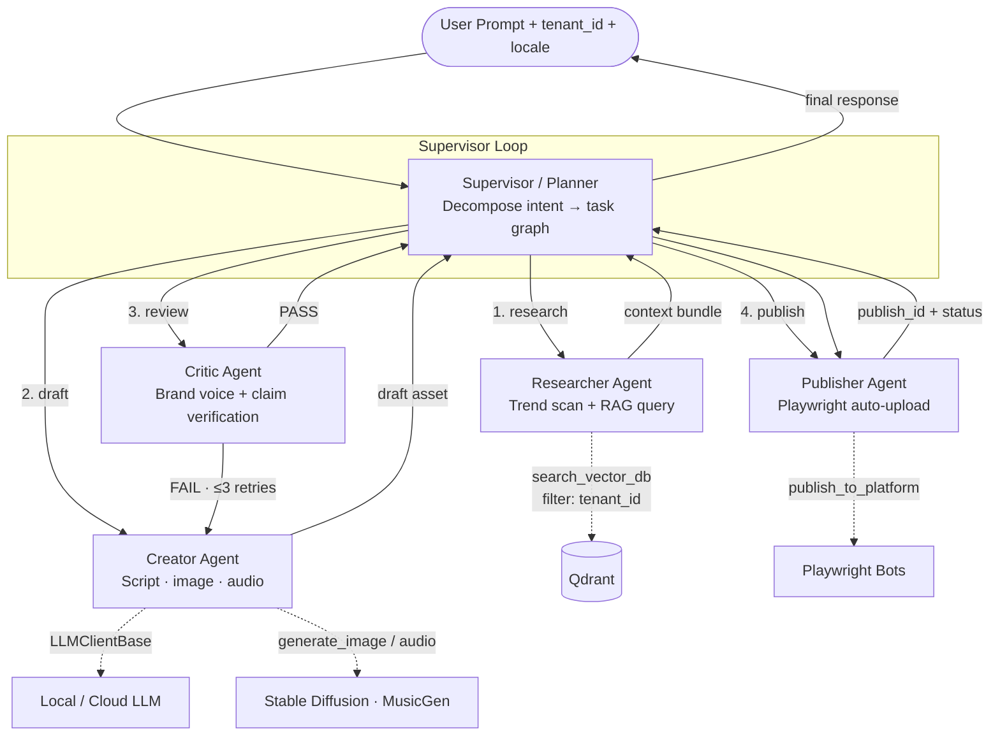

<!--
═══════════════════════════════════════════════════════════════════════════
🟢 REPO SCOPE BANNER — n-assistant-core (MIT · OPEN-SOURCE)
═══════════════════════════════════════════════════════════════════════════
The Multi-Agent System described here IS the heart of THIS open-source repo —
Supervisor, Researcher, Creator, Critic, Publisher, the tool registry and the
LangGraph state machine all live in n-assistant-core under `app/`.

Boundary reminders binding in THIS repo:
  • Agents call LLMs ONLY through `LLMClientBase` — never `openai.*` directly.
  • NO billing/credit-debit logic, NO auth/user-management, NO SaaS dashboard
    code here. Token counting emits usage metadata; the actual wallet debit
    (TenantCredits / Stripe) happens in n-assistant-cloud.
  • `tenant_id` arrives via the REST/WebSocket API from cloud; core trusts and
    enforces it but does NOT manage tenant identity/auth itself.

See [`../rules/tech-stack-rule.md`](../rules/tech-stack-rule.md).
═══════════════════════════════════════════════════════════════════════════
-->

# 🧠 ORCHESTRATION & AI AGENT DESIGN — N Assistant V2.0

> **DOCUMENT PURPOSE:** Defines the Multi-Agent System (MAS) architecture, agent profiles, tool registry, and execution workflow for N Assistant.
> **FRAMEWORK:** LangGraph (state-machine graph) atop FastAPI orchestrator, calling `LLMClientBase` engines.
> **COMPANION DOCS:** [`../docs/product-requirements.md`](../docs/product-requirements.md) · [`../rules/tech-stack-rule.md`](../rules/tech-stack-rule.md).

---

## §1. Why Supervisor–Worker, NOT Zero-Shot

A single mega-prompt ("be a marketing agent, do everything") is **forbidden** in this system. Reasons:

1. **Hallucination compounding.** When one prompt is responsible for research + draft + review, errors in the research step poison the draft with no checkpoint.
2. **No auditability.** A single LLM call leaves no trace of *why* a claim was made.
3. **Brand-voice drift.** Without a dedicated reviewer step, generated content drifts off-brand within 2–3 turns.
4. **Cost explosion.** A single big-context call burns 5–10× the tokens of specialized small-context calls.

N Assistant uses a **Supervisor–Worker** pattern: a Planner agent decomposes the user intent into ordered tasks; specialized Worker agents execute one task each with the minimum context they need; a Critic agent verifies before publication.

---

## §2. Topology



Implementation: LangGraph state machine. Each agent is a node, edges are conditional routes the Supervisor picks based on the state.

---

## §3. Agent Roles

### §3.1 Supervisor (Planner)

- **Goal:** Translate a user intent into an ordered task graph; route each task to the right worker; assemble the final response.
- **Holds the state:** `{ tenant_id, user_id, locale, intent, plan, scratchpad, retry_count, current_step }`.
- **Decision authority:** which worker runs next, when to short-circuit, when to give up after retries.
- **Forbidden:** generating user-facing content directly. The Supervisor coordinates; it does not write copy.
- **LLM tier:** Tier-1 (Cloud or strong local). Cheap to call, expensive to get wrong.

### §3.2 Researcher

- **Goal:** Gather grounded context for the Creator.
- **Tools:** `search_vector_db(tenant_id, query, top_k=8, locale=...)`, `fetch_trends(platform, locale, window="7d")`.
- **Output:** a context bundle `{retrieved_chunks: [...], trend_signals: [...], sources: [...]}`.
- **Forbidden:** generating any text the user will see; expressing opinions; calling Vector DB without `tenant_id`.
- **LLM tier:** Tier-2 (local OK). Mostly tool-calling, light reasoning.

### §3.3 Creator

- **Goal:** Produce a draft asset (script, post copy, image prompt, audio prompt, storyboard) grounded **strictly** in the Researcher's context bundle.
- **Tools:** `generate_text`, `generate_image(prompt, style)`, `generate_audio(script)`, `compose_storyboard`.
- **Discipline:** Every factual claim in the draft MUST be traceable to a Researcher source ID. Untraceable claim → Critic flags it.
- **Forbidden:** calling the Vector DB directly; introducing facts not present in context; publishing.
- **LLM tier:** Tier-1 for hero copy; Tier-2 for variants.

### §3.4 Critic (Reviewer)

- **Goal:** Verify the draft against three checks before it gets published:
  1. **Brand voice** — match tenant's brand-voice rubric (stored in their RAG).
  2. **Claim grounding** — every claim links back to a Researcher source ID. Untraceable → FAIL.
  3. **Policy** — platform-specific (TikTok/YT/FB) content policy heuristics.
- **Output:** `{verdict: "pass" | "fail", reasons: [...], suggested_edits: [...]}`.
- **Loop:** on FAIL, hand back to Creator with `suggested_edits`. Max **3 retries**; on 4th attempt Supervisor escalates to human review.
- **Forbidden:** rewriting the draft itself (its job is to judge, not to ghost-write).
- **LLM tier:** Tier-1 mandatory. The Critic is the moat against hallucination — do not cheap out.

### §3.5 Publisher

- **Goal:** Push the approved asset to the requested platforms.
- **Tools:** `publish_to_platform(tenant_id, asset_id, platform, schedule_at)`.
- **Side effects:** triggers Playwright auto-upload Celery job; updates `posts` table; emits WebSocket event to dashboard.
- **Forbidden:** content modification; reading other tenants' sessions; making LLM calls.
- **LLM tier:** none — Publisher is a deterministic tool-runner, not a reasoning agent.

---

## §4. Tool Registry (Pydantic v2 contracts)

Every tool input is a Pydantic v2 model with `model_config = ConfigDict(extra="forbid")`. The Supervisor refuses to call a tool whose schema doesn't validate.

```python
class SearchVectorDBInput(BaseModel):
    model_config = ConfigDict(extra="forbid")
    tenant_id: UUID
    query: str = Field(min_length=1, max_length=512)
    top_k: int = Field(default=8, ge=1, le=20)
    locale: Literal["vi", "en", "de", "zh"]

class GenerateTextInput(BaseModel):
    model_config = ConfigDict(extra="forbid")
    tenant_id: UUID
    prompt: str
    context_bundle_id: str   # references Researcher output, anti-hallucination
    locale: Literal["vi", "en", "de", "zh"]
    max_tokens: int = Field(default=512, ge=1, le=4096)
    tier: Literal["local", "cloud"] = "local"

class PublishToPlatformInput(BaseModel):
    model_config = ConfigDict(extra="forbid")
    tenant_id: UUID
    asset_id: UUID
    platform: Literal["tiktok", "youtube_shorts", "facebook", "instagram"]
    schedule_at: datetime | None = None
```

**Every tool input carries `tenant_id`.** No exceptions.

---

## §5. State, Memory & Persistence

| Scope | Mechanism | TTL |
|---|---|---|
| Per-turn agent state | LangGraph state object in memory | Lifetime of the request |
| Per-task scratchpad | LangGraph state + Redis snapshot for resume | 24h |
| Per-tenant long-term memory | Qdrant (tenant-filtered) | Permanent |
| Per-tenant brand voice / policy | Postgres `tenant_voice_profile` table | Permanent |
| Per-user session | JWT + `auth_sessions` row | 30d |
| Audit trail | `audit_log` table partitioned by `tenant_id` | 7y (compliance) |

Resumability: every Supervisor decision boundary checkpoints to Redis with a `run_id`. A crashed run can be resumed from the last checkpoint without re-paying upstream token costs.

---

## §6. Error Handling, Retries, Idempotency

| Failure mode | Handling |
|---|---|
| Worker tool raises | Bubble to Supervisor; Supervisor decides retry vs escalate. **Never** swallow with bare `except`. |
| Critic FAIL | Loop back to Creator with `suggested_edits`. Max 3 cycles. |
| LLM rate limit | Exponential backoff + tier fallback (Cloud → Local). Logged. |
| Publisher Playwright failure | Mark job failed in DB; surface to dashboard; do **not** retry blindly (risks platform spam-detection). |
| Vector DB timeout | Researcher returns empty context bundle with `degraded=true`; Critic refuses to pass any draft built on degraded context. |

**Idempotency keys** (`(tenant_id, run_id, step_id)`) on every Publisher call so a retry never double-posts.

---

## §7. Multilingual Behavior

- Supervisor injects `locale` into every Worker's prompt.
- Researcher passes `locale` to RAG; bge-m3 handles cross-lingual matching → a German-locale request can still retrieve Vietnamese knowledge base entries if relevant.
- Creator's drafts are produced in the user's `locale`; brand voice rubric is matched on the locale-specific section of the tenant's voice profile.
- Critic verifies in the same locale as the draft.
- Publisher posts with platform locale set to the user's locale.

---

## §8. Strict Agent Rules

1. **Every tool call MUST carry `tenant_id`.** A tool without `tenant_id` in its input schema does not exist.
2. **No agent calls `openai.*` / `anthropic.*` / `transformers.pipeline(...)` directly.** Always `LLMClientBase`.
3. **Creator MUST cite source IDs from Researcher context.** Uncited claim → Critic FAIL.
4. **Critic CANNOT rewrite drafts.** Only judge and suggest.
5. **Publisher CANNOT make LLM calls.** Deterministic tool runner only.
6. **No agent has internet egress except Publisher** (and Publisher only to the configured social platforms via Playwright).
7. **A new agent role requires an RFC and an update to §3 of this doc.** Rogue agents are a CI failure.
8. **Every Supervisor decision MUST be logged** with `{tenant_id, run_id, step, chosen_agent, reason}` for replay & audit.

---

## §9. Future Roles (Not Yet Implemented)

Documented here so the system knows where they slot in when added. Implementation requires RFC + update of §3.

- **Analyst** — post-publication: pull engagement metrics, feed back into Researcher's "what worked" memory per tenant.
- **Negotiator** — for brand-collab tenants: draft pitch DMs / email outreach with guardrails.
- **A/B Director** — split test variants of the same asset across audience segments and reconcile winners.
