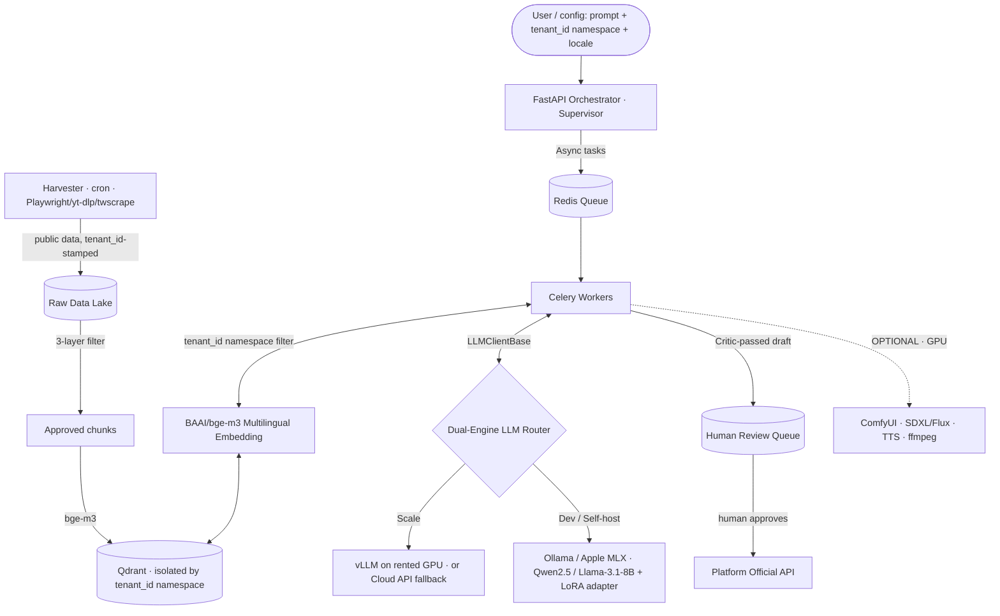

<!--
═══════════════════════════════════════════════════════════════════════════
🟢 REPO SCOPE BANNER — Nyxara (MIT · OPEN-SOURCE · SINGLE REPO)
═══════════════════════════════════════════════════════════════════════════
This is the architecture spec for the WHOLE project. There is ONE repo, MIT.
This is a personal / community LEARNING engine — an open-source multilingual
RAG + agentic engine you fork and customize for your own niche, aimed at
seller-affiliate content automation with a human in the loop. It is NOT a SaaS
product: no billing, no user auth, no admin dashboard, no commercial cloud.
It does NOT auto-publish: drafts go to a human; sending uses official APIs.

  • `tenant_id` exists ONLY as a namespace so one install can host several
    niches/users side by side in the vector store. It is NOT customer-billing
    isolation. Think "folder per niche", not "tenant per paying customer".
  • Everything runs standalone in Docker / on a self-hosted box. Zero
    dependency on any external SaaS layer.

See [`../rules/tech-stack-rule.md`](../rules/tech-stack-rule.md) for the
enforceable engineering rules.
═══════════════════════════════════════════════════════════════════════════
-->

# 🌍 ARCHITECTURE SPECIFICATION — Nyxara (V5.0, Learning Edition · Niche-Focused)

> **V5.0 changelog (Niche refocus):** repositions from "Virtual Content Factory / autonomous auto-publish" → a **multilingual RAG + agentic engine, built from scratch as a learning vehicle**, aimed at one concrete niche: content & social automation for **seller-affiliates on TikTok Shop / Shopee (VN)**, **human-in-the-loop**. **Removes browser auto-posting from the main path** (Playwright stealth, AES-256 session vault, scheduled auto-posting) — when publishing is needed, use the platform's **official API**. Demotes the **Visual & Character Engine to an OPTIONAL track**. Expands Advanced RAG (adds reranking, metadata filtering, semantic chunking) and **pulls basic evaluation (RAGAS + A/B) up into Phase 3**. Carries over from V4.0: single MIT repo, `tenant_id` as a **namespace for multiple niches/users**, LoRA fine-tuning, light MLOps. Canonical roadmap: [`master-execution-plan.md`](master-execution-plan.md).
>
> **DOCUMENT CLASSIFICATION:** Core engineering spec. Binding for every AI agent and human contributor on the project.
> **PROJECT VISION:** Nyxara is an open-source, modular **multilingual RAG + agentic engine** — fork it for your niche, run it 100% local. The point is to *learn* AI engineering from scratch (advanced RAG, fine-tuning, agentic, eval) with a concrete destination: a **Comment Assistant** for seller-affiliates that reads public comments, retrieves the right product info, drafts an on-voice reply, and hands it to a **human to approve before sending** (no auto-post).
> **FIRST CORE PRODUCT:** the **Comment Assistant** — read public comments under a selling video → RAG-retrieve product info (price/usage/link), metadata-filtered to *that* product → draft reply → **Critic blocks fabricated facts & unverified efficacy claims** → **human approves** → send via **official API**.
> **LANGUAGES SUPPORTED END-TO-END:** Vietnamese (VN), English (EN), German (DE), Chinese (CN).
> **CONSTITUTIONAL FILES:** This doc · [`../rules/tech-stack-rule.md`](../rules/tech-stack-rule.md) · [`ai-agent-design.md`](ai-agent-design.md).

---

## §0. GLOBAL STRATEGIC VISION (System Prompts)

Inject the locale-matched line into the root context of every working AI Agent.

- 🇻🇳 **Vietnamese:** Nyxara là một động cơ RAG đa ngôn ngữ + agentic mã nguồn mở, modular — fork cho niche của bạn, chạy 100% local. Cốt lõi: RAG đa namespace, suy luận Hybrid (Local/Cloud), và pipeline agentic có người duyệt (human-in-the-loop) cho seller-affiliate. Mục tiêu là học sâu toàn bộ stack.
- 🇬🇧 **English:** Nyxara is an open-source, modular multilingual RAG + agentic engine — fork it for your niche, run it 100% local. The core is namespace-scoped RAG, hybrid inference routing (Local vs Cloud), and a human-in-the-loop agentic pipeline for seller-affiliates. The goal is to learn the full stack deeply.
- 🇩🇪 **German:** Nyxara ist eine quelloffene, modulare mehrsprachige RAG- + Agenten-Engine — forke sie für deine Nische, betreibe sie 100% lokal. Kern: namespace-gebundenes RAG, hybride Inferenz (Lokal/Cloud), eine Human-in-the-Loop-Agenten-Pipeline für Seller-Affiliates. Ziel ist tiefes Lernen des gesamten Stacks.
- 🇨🇳 **Chinese:** Nyxara 是一个开源、模块化的多语言 RAG + 智能体引擎 — 为你的细分领域 fork，100% 本地运行。核心：按命名空间隔离的 RAG、混合推理路由（本地/云）、面向卖家联盟的人工介入（human-in-the-loop）智能体流水线。目标是深入学习整个技术栈。

---

## §1. CODEBASE STRATEGY — One Repo, MIT

| Repo | License | Stack | What lives here |
|---|---|---|---|
| **`nyxara`** | MIT (public) | Python 3.11 · FastAPI · LangGraph · Qdrant · PyTorch · *(optional: ComfyUI)* | Everything on the main path: harvester, RAG pipeline (Hybrid + RRF + rerank + CRAG), agent workflows (human-in-the-loop), fine-tuning scripts, eval. The visual/video engine is an **optional** add-on (needs GPU). Runs in Docker, native on Mac M-series, or self-hosted GPU. |

**There is no second repo and no commercial layer.** Anything you'd expect in a SaaS — billing, user accounts, RBAC, an admin dashboard — is **out of scope by design**. A user-facing UI, if ever added, is a thin optional Streamlit/Gradio panel that calls the same local API; it never becomes a tenancy/billing system.

---

## §2. DATA FLOW (Single-Process, Local-First)



**No auto-publish.** A Critic-passed draft lands in a human review queue; only an
approved item is sent, and only via the platform's **official API** — never a
headless/stealth browser. The visual/video path is an **optional** GPU add-on.

Optional persistence (Postgres) holds local config, source registry, and run history — **not** users or billing.

---

## §3. DETAILED ARCHITECTURE LAYERS

### §3.1 Entry & Config Layer

- **Primary interface:** the unified `cli.py` + the FastAPI orchestrator. Optional thin UI (Streamlit/Gradio) is a nice-to-have, never required.
- **Config-driven:** a single `config.yaml` (planned, Phase 6) lets a forker pick model, niche, output style without touching code. Harvester sources live in `scraper_config.yaml`.
- **Namespace, not auth:** requests carry a `tenant_id` namespace + `locale`. There is no login, no JWT, no role system. The namespace simply selects which niche's data and style apply.

### §3.2 Orchestration Layer

- **Framework:** Python FastAPI, Hexagonal Architecture (`app/domain`, `app/application`, `app/infrastructure`, `app/api`).
- **Responsibility:** receive a request, split documents (text splitter), drive the Supervisor-Worker agent graph (see [`ai-agent-design.md`](ai-agent-design.md)).
- **Hard rule:** when `INFERENCE_MODE=self_hosted`, the orchestrator **MUST NOT** make any outbound HTTPS call to OpenAI/Anthropic/Gemini. CI gate verifies via `grep`. (Privacy-by-default for a fully-local fork.)

### §3.3 Multi-Niche RAG Layer

- **Vector DB:** Qdrant (the single approved vector store).
- **Namespace isolation:** a dedicated collection per niche, or a single collection with a **mandatory** `tenant_id` payload filter on every `upsert` and `search`. Cross-namespace bleed is an architectural violation — your MMO niche must never retrieve Game-AI chunks.
- **Pipeline:** LangChain text splitters → `BAAI/bge-m3` embedding → Qdrant upsert with metadata `{tenant_id, doc_id, source, locale, ingested_at}`.
- **Cross-lingual capability:** `bge-m3` produces a single shared embedding space across VN/EN/DE/CN → a Vietnamese niche can query its German knowledge base without a translation pre-pass.
- **Advanced RAG (Phase 3) — a togglable 3-stage pipeline** (full spec: [`master-execution-plan.md`](master-execution-plan.md) Phase 3; engineering rules: [`../rules/tech-stack-rule.md`](../rules/tech-stack-rule.md) §5):
  - **Pre-Retrieval — Query Transformation** *(optional, per-query)*: **Multi-Query** (split a complex question into 3–4 sub-queries, fuse via RRF) and **HyDE** (embed a hypothetical answer instead of the raw question) to close the query↔document vocab gap on deep niches. Each costs one async local-LLM call (~2–4 s); a status run-event is emitted so it doesn't read as a hang.
  - **Retrieval — Metadata-filter → Hybrid + RRF → Rerank → Small-to-Big**: a **metadata payload filter** (`product_id`, `price_band`, `category`, `locale`) narrows to the right product/price band **before** semantic ranking (used live by the Comment Assistant — *not* "closest vector wins"); dense (bge-m3) + sparse (BM25) are fused with **Reciprocal Rank Fusion (RRF)**; a **cross-encoder reranker (`bge-reranker-v2-m3`)** re-scores the top-k by reading query+doc *together* (the biggest top-k quality lift after retrieval; **bi-encoder vs cross-encoder** trade-off). **Chunking** is a mode (`chunk_strategy="flat" | "semantic" | "parent_child"`): **semantic chunking** splits by meaning rather than fixed length, and **Parent-Child** indexes ~200-tok children for precision and fetches the ~1000-tok parent for context via a Qdrant payload index on `parent_id`.
  - **Post-Retrieval — Context Compression** *(optional)*: an `LLMClientBase` extractor keeps only the query-answering sentences (verbatim, no paraphrase; raw-chunk fallback on a non-substring extraction) to fit the local model's token budget. *Not LLMLingua* — that stays a Phase 6 option.
  - **Self-correction:** **Corrective RAG (CRAG)** wraps the above as a LangGraph loop that grades retrieval quality and self-corrects **inside the local store** (re-query, widen `top_k`, relax threshold, BM25-only fallback) before generation — **no internet egress by default**. An optional `web_search` correction tool is **off by default and hard-disabled when `INFERENCE_MODE=self_hosted`** ([`ai-agent-design.md`](ai-agent-design.md) §8.6). A per-niche **domain adapter** biases retrieval toward the active niche.
  - **Measured, not assumed:** a fixed gold eval set (≈10–20 Q/A per niche) + **RAGAS** (faithfulness, answer relevancy, context precision/recall) land **in Phase 3**, so every technique above is A/B'd **on vs off** and kept only if the metrics justify the latency. Heavy MLOps stays in Phase 6 (§3.7).
- **Learning focus:** code cosine similarity and the RRF formula by hand before leaning on libraries; understand the **bi-encoder vs cross-encoder** distinction, query↔document space mismatch, chunk-granularity trade-offs (semantic vs fixed; small-to-big), metadata pre-filtering, token-budget management, and **RAG evaluation metrics**. Retrieval logic stays **pure Python + `LLMClientBase` + `qdrant-client`** (no LangChain retriever wrappers); LangGraph owns flow only (§5).

### §3.4 Dual-Engine AI Inference

A single OpenAI-compatible interface `LLMClientBase` lets agents swap engines via config without code change.

```python
class LLMClientBase(Protocol):
    async def complete(self, *, messages: list[Message], tools: list[Tool] | None = None, max_tokens: int) -> Completion: ...
```

| Tier | Use case | Implementation |
|---|---|---|
| **Local / Dev** | Zero-cost R&D, offline work, full privacy | Ollama (`:11434`) or Apple MLX serving `Qwen2.5-7B` or `Llama-3.1-8B-Instruct`, optionally with a fine-tuned LoRA adapter |
| **Scale** | Heavy batch / large dataset runs | vLLM on a rented GPU (RunPod, AWS, Lambda Labs), or fallback to a cloud API for peak load |

Routing decision is config (`INFERENCE_MODE=local|cloud|hybrid`), not code. Agent code is identical across tiers.

**"Tier" is a logical role, not a fixed model.** Tier-1 (Supervisor, Critic, hero Creator) = the strongest engine *available in the current deployment*; Tier-2 (Researcher, variants, CRAG grader) = a cheaper/faster engine. The mapping is config, and the honest reality differs by hardware:

| Hardware | Tier-1 engine | Tier-2 engine | Honest caveat |
|---|---|---|---|
| GPU box (≥12 GB) or rented vLLM | local 7B+ (Qwen2.5-7B / Llama-3.1-8B) | same or 3B | full design holds |
| **No-GPU / CPU box** (e.g. Ollama `qwen2.5:3b`) | best local 3B — **best-effort only** | 3B | the Critic + CRAG grader are weak judges at 3B; **anti-hallucination guarantees degrade**. Route Tier-1 to a cloud API (`hybrid`) to restore them — at the cost of "100% local". |
| Hybrid (recommended for no-GPU learners) | cloud API for Tier-1 | local 3B for Tier-2 | strong judging where it matters, cheap local work elsewhere |

> **The OPTIONAL Visual & Character Engine (ComfyUI SDXL/Flux + video/TTS) requires a real GPU** — it is *not* realistically CPU-local, which is one reason it sits off the main learning path. The "100% local" promise holds end-to-end only on a GPU box; on CPU-only hardware, the CORE phases (0–7) run locally while Tier-1 reasoning needs a cloud route and the optional visual track needs a GPU. Set this expectation in the README.

### §3.5 Fine-tuning Layer (Phase 4)

- **Method:** LoRA (low-rank adaptation) on `Qwen2.5-7B`. Train a **base adapter** on the shared content style + optional **per-niche adapters** (seller-affiliate, beauty…). A forker can train their own adapter for their niche — this is a core open-source value.
- **Dataset design:** multi-domain — a common base dataset plus per-niche fine-tune examples. Track JSON-output parsing rate, style consistency, and hallucination rate before/after.
- **Embedding / domain fine-tuning lives here too** (same fine-tuning cluster, *not* Phase 3): when the Phase 3 gold-set eval shows retrieval is the bottleneck, adapt `bge-m3` to the niche's vocabulary and re-measure retrieval precision on that gold set.
- **Quantization & serving:** merge adapter → GGUF (Q4/Q5/Q8) → serve via Ollama.
- **Learning focus:** the low-rank update math (`W + ΔW = W + B·A`), why rank `r` matters, quantization trade-offs, and embedding fine-tuning.

### §3.6 Visual & Character Engine — *OPTIONAL track (needs GPU, off the main path)*

> **Not on the main learning path.** This teaches diffusion/video, not the core
> AI-engineering route, and requires a real GPU. The agent/plugin architecture
> lets it be added **later without breaking** what's built — it slots a Visual
> Director + Video Producer into the agent graph without changing existing roles'
> contracts ([`ai-agent-design.md`](ai-agent-design.md) §3.6–3.7).

- **Consistent character / avatar:** ComfyUI + IP-Adapter + FaceID + a character LoRA so the same virtual KOL / game character appears across videos. Forkers can train their own character.
- **Image generation:** Flux / SDXL + ControlNet (pose, outfit, product placement). The LLM emits structured JSON with `visual_prompt`, `style`, `scene` fields that drive the pipeline.
- **Video:** image-to-video / text-to-video (local models), lip-sync, TTS voice cloning (XTTS / CosyVoice), auto-editing with ffmpeg (subtitles, trend music, transitions).
- **Modular plugin system:** a forker can add their own ComfyUI workflow for their niche (e.g. Game-AI gameplay footage + AI-commentary overlay).

### §3.7 Async Jobs, Observability & Evaluation Layer

- **Workers:** Redis broker + Celery for any task >2s (PDF ingest, embedding batches, video render, Playwright upload). Progress via WebSocket or polling.
- **Logging:** `structlog` with fields `{tenant_id, request_id, agent, tool, latency_ms, token_usage, retrieval_score}`. Token counting emits **usage metadata for observability** — there is no wallet/billing debit.
- **Monitoring:** LangFuse or Prometheus + Grafana for latency, token usage, and retrieval scores (Phase 6).
- **Evaluation:** **RAGAS + a hand-built gold set land in Phase 3** (≈10–20 Q/A per niche) — faithfulness, answer relevancy, context precision/recall + custom metrics (e.g. right-product hit rate) — so every advanced-RAG technique is A/B'd on vs off. **Phase 6** then scales this into release-over-release tracking, LLM-as-Judge and small human-eval sets, and before/after fine-tuning comparison on a fixed test set. (Visual-consistency / engagement-proxy metrics only apply if the optional Visual track is built.)
- **Error handling & fallback:** every layer fails safe (e.g. if CRAG can't ground an answer, the Critic refuses to pass it).

### §3.8 Harvester Layer (Data Ingestion — strictly separate from Inference)

The Harvester is an **autonomous data-acquisition subsystem**, fully decoupled
from the LLM agent graph. It enforces a hard separation of concerns:
**Data Ingestion ≠ Inference.** The Harvester only *acquires and lands* data; it
never reasons, never calls an LLM, and shares no process with the agents.

- **Engine:** plugin extractors (Playwright + `playwright-stealth`, `yt-dlp`, `twscrape`), driven on a schedule by **cron / Celery Beat**.
- **Zero-hardcode sources:** every scraping target is declared in
  **`scraper_config.yaml`** (URL, selectors, cadence, locale, `tenant_id`).
  **No URL is ever hardcoded in Python.** Reloading the YAML reconfigures the
  harvester without a redeploy.
- **Pipeline (4 stages):**
  1. **Crawl** — fetch the configured *public* pages.
  2. **Raw Data Lake** — raw JSON landed immutably, stamped with
     `{tenant_id, source, harvested_at}` **at this layer already**.
  3. **Filter (Clean)** — 3-layer anti-spam (L1 heuristic → L2 text-clean →
     L3 batched LLM judge), dedupe, language detect.
  4. **Vector Ingestion** — cleaned chunks → `BAAI/bge-m3` → **Qdrant** upsert
     with the mandatory `tenant_id` namespace filter (same isolation as §3.3).
- **Isolation from agents:** the Harvester *writes* to Qdrant; the Researcher
  agent only *reads*. They never call each other.

**Compliance (binding):**
- Harvest **public data only.** Respect `robots.txt` / platform ToS; rate-limit per source.
- **`tenant_id` is stamped at the Harvester layer** — on the very first raw file,
  not bolted on downstream. A harvested artifact missing `tenant_id` is discarded.

### §3.9 Extensibility & Community Layer (Phase 7)

- **Plugin architecture everywhere:** new scraper, new visual backend, new TTS, new LLM client — all drop-in via a one-file contract.
- **Niche templates:** MMO Affiliate, Game AI, Tech, Education… ship as example configs + datasets so a forker is productive in minutes.
- **Example projects:** e.g. "How to make Game-AI Shorts in 5 minutes."

---

## §4. STRICT EXECUTION DISCIPLINE

1. **TDD is mandatory.** Every RAG, agent, and tool change requires red→green→refactor. RAG logic requires **cross-language tests** (VN, EN, DE, CN). No green CI → no merge.
2. **Micro-commits.** Each working function ships as its own commit. Conventional Commits format.
3. **Namespace isolation.** No library outside the approved stack without a note in the spec. The `tenant_id` namespace check is non-negotiable on every DB / Vector DB path.
4. **No raw LLM API calls.** Always go through `LLMClientBase`. Direct `openai.*` or `transformers.pipeline(...)` calls in agent code are a CI failure.
5. **Local-first & extensible.** Default to a fully-local, offline-capable path. New sources/backends are plugins, not core edits.

---

## §5. NON-FUNCTIONAL TARGETS (Learning Benchmarks, not SLAs)

These are targets to *measure and learn from* on a personal/self-hosted box — not customer SLAs.

| Concern | Target |
|---|---|
| RAG retrieval only (no LLM in loop) | p95 < 800ms on Mac M-series MPS for top-k retrieval |
| LLM tool-call latency (single call) | p95 < 4s (local Qwen2.5-7B) / < 2s (rented vLLM GPU) |
| Full advanced-RAG pass (Phase 3, all flags on) | budget p95 **< 12–15s on local 3B** — HyDE + CRAG grade + (re-query) + compression stack several LLM calls; this is *why* each stage is a flag. On GPU/7B target **< 6s**. The 800ms/4s rows above are the *plain* path with advanced flags off. |
| Multi-niche isolation | Cross-namespace bleed rate = 0 (verified by test) |
| Embedding throughput | ≥ 500 docs/min on Mac M-series MPS, ≥ 5000 docs/min on a prod-class GPU |
| RAG eval (Phase 3 basic · Phase 6 at scale) | RAGAS faithfulness & answer-relevance tracked; every advanced-RAG flag A/B'd on vs off |
| Fine-tune quality (Phase 4) | JSON-output parse rate ↑, hallucination rate ↓ vs base, on a fixed test set |
| Cost per generated post | ≤ $0.05 local, ≤ $0.30 on rented GPU (measured, for awareness) |
